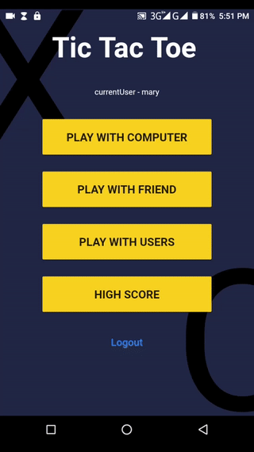
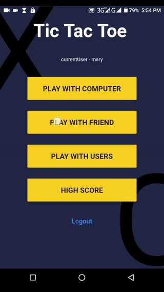
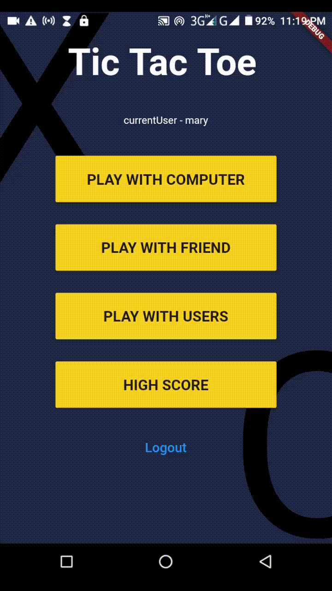
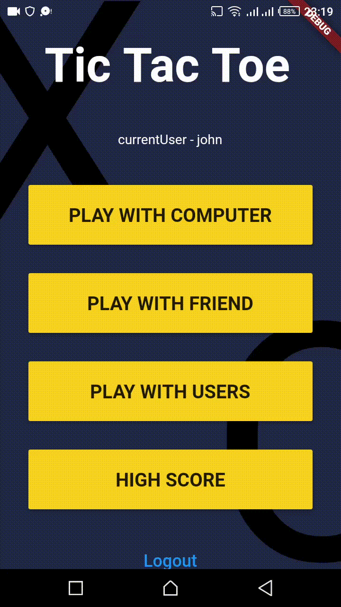
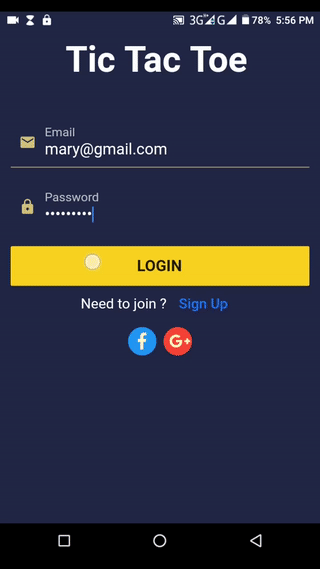

# flutter_firebase_tic_tac_toe

A Tic Tac Toe (X and O) application designed with flutter.  
Got the design from uplab https://www.uplabs.com/posts/android-tic-tac-toe-ui-concept  - by Amit Singh and I decided to build the app just for fun! 

Tic Tac Toe app is designed using the following:  

* Firestore for backend
* Flutter BLoC pattern
* Cloud Functions
* Firebase Notification 
* Social Authentication / Firebase Authentication

## Play with Computer

## Play with Friend on device

## Play with Registered User
  

## Authentication Page

